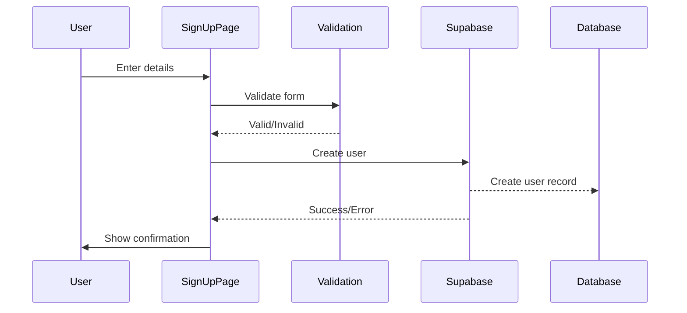
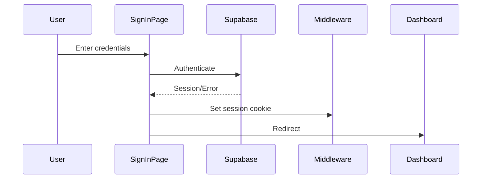

# Authentication System Guide

This guide explains the authentication system implementation in Shelly Monitor.

## Overview

Shelly Monitor uses Supabase Auth for authentication with:
- Email/password authentication
- Session management with cookies
- Protected routes via middleware
- Role-based access control (RBAC)
- Material Design 3 UI components

## Architecture

### Components

1. **Auth Pages** (`/auth/*`)
   - Sign In: `/auth/signin`
   - Sign Up: `/auth/signup`
   - Password Reset: `/auth/reset-password`

2. **Auth Hooks** (`src/lib/auth/hooks.ts`)
   - `useAuth()`: Core auth hook for all operations
   - `useRequireAuth()`: Protect authenticated routes
   - `useRequireNoAuth()`: Redirect if already authenticated

3. **Validation** (`src/lib/auth/validation.ts`)
   - Zod schemas for form validation
   - Password strength requirements
   - Email format validation

4. **Middleware** (`src/middleware.ts`)
   - Session validation
   - Route protection
   - Redirect handling

## Authentication Flow

### Sign Up Flow


### Sign In Flow


## Usage

### Protecting Pages

Use the `useRequireAuth` hook to protect pages:

```tsx
import { useRequireAuth } from '@/lib/auth/hooks';

export default function ProtectedPage() {
  const { user, loading } = useRequireAuth();
  
  if (loading) return <LoadingSpinner />;
  
  return (
    <div>
      Welcome, {user.email}!
    </div>
  );
}
```

### Redirecting Authenticated Users

Use `useRequireNoAuth` for auth pages:

```tsx
import { useRequireNoAuth } from '@/lib/auth/hooks';

export default function SignInPage() {
  useRequireNoAuth('/dashboard'); // Redirect to dashboard if signed in
  
  return <SignInForm />;
}
```

### Using Auth Operations

```tsx
import { useAuth } from '@/lib/auth/hooks';

function MyComponent() {
  const { user, signIn, signUp, signOut, resetPassword } = useAuth();
  
  const handleSignIn = async () => {
    try {
      await signIn(email, password);
      // Success - user is redirected
    } catch (error) {
      // Handle error
    }
  };
  
  const handleSignOut = async () => {
    await signOut(); // Redirects to /auth/signin
  };
}
```

## Form Validation

### Sign In Validation
```typescript
const signInSchema = z.object({
  email: z.string().email(),
  password: z.string().min(1),
  rememberMe: z.boolean().optional(),
});
```

### Sign Up Validation
```typescript
const signUpSchema = z.object({
  name: z.string().min(2).max(50),
  email: z.string().email(),
  password: z.string()
    .min(8)
    .regex(/[A-Z]/, 'Must contain uppercase')
    .regex(/[a-z]/, 'Must contain lowercase')
    .regex(/[0-9]/, 'Must contain number')
    .regex(/[^A-Za-z0-9]/, 'Must contain special character'),
  confirmPassword: z.string(),
  acceptTerms: z.boolean().refine(val => val === true),
}).refine(data => data.password === data.confirmPassword);
```

## UI Components

### AuthLayout
Provides consistent layout for auth pages:

```tsx
<AuthLayout 
  title="Sign In" 
  subtitle="Welcome back to Shelly Monitor"
>
  {/* Form content */}
</AuthLayout>
```

### Features:
- Responsive design
- Theme toggle
- Logo and branding
- Consistent spacing

## Security Features

### Password Requirements
- Minimum 8 characters
- At least one uppercase letter
- At least one lowercase letter
- At least one number
- At least one special character

### Session Management
- Secure HTTP-only cookies
- Automatic session refresh
- Session expiry handling

### Route Protection
- Middleware-based protection
- Redirect with return URL
- API route protection (401 responses)

## Test Accounts

For development and testing:

```
Email: demo@shellymonitor.com
Password: Demo123!

Email: test@shellymonitor.com
Password: Test123!
```

## Database Setup

Run this SQL in Supabase to set up the users table:

```sql
-- Make password_hash nullable for Supabase Auth
ALTER TABLE users ALTER COLUMN password_hash DROP NOT NULL;

-- Create trigger for auto user record creation
CREATE OR REPLACE FUNCTION public.handle_new_user()
RETURNS trigger AS $$
BEGIN
  INSERT INTO public.users (id, email, name, role)
  VALUES (
    new.id,
    new.email,
    COALESCE(new.raw_user_meta_data->>'name', split_part(new.email, '@', 1)),
    COALESCE(new.raw_user_meta_data->>'role', 'user')
  );
  RETURN new;
END;
$$ LANGUAGE plpgsql SECURITY DEFINER;

CREATE TRIGGER on_auth_user_created
  AFTER INSERT ON auth.users
  FOR EACH ROW EXECUTE FUNCTION public.handle_new_user();
```

## Testing Authentication

### Manual Testing
1. Navigate to `/auth/signin`
2. Test sign in with test accounts
3. Verify redirect to dashboard
4. Test sign out functionality
5. Test protected route access

### Automated Testing
Run the auth test script:

```bash
npm run test:auth
# or
npx tsx scripts/test-auth.ts
```

### Creating Test Users
```bash
npx tsx scripts/create-test-users.ts
```

## Common Issues

### "Database error creating new user"
- Ensure `password_hash` column is nullable
- Run `fix-users-table.sql` in Supabase

### Session not persisting
- Check cookie settings in browser
- Ensure `NEXT_PUBLIC_SUPABASE_URL` is correct
- Verify Supabase project settings

### Redirect loops
- Clear browser cookies
- Check middleware configuration
- Verify public routes list

## Customization

### Adding OAuth Providers
1. Enable provider in Supabase dashboard
2. Add provider buttons to sign in page
3. Handle OAuth callbacks

### Custom Fields
1. Add fields to sign up form
2. Update validation schema
3. Store in `user_metadata`

### Role-Based Access
1. Add role checks in middleware
2. Create role-specific hooks
3. Implement permission system

## Best Practices

1. **Always validate input** - Use Zod schemas
2. **Handle errors gracefully** - Show user-friendly messages
3. **Use loading states** - Prevent multiple submissions
4. **Implement rate limiting** - Already in middleware
5. **Log security events** - Use audit logging
6. **Keep sessions secure** - Use HTTPS in production