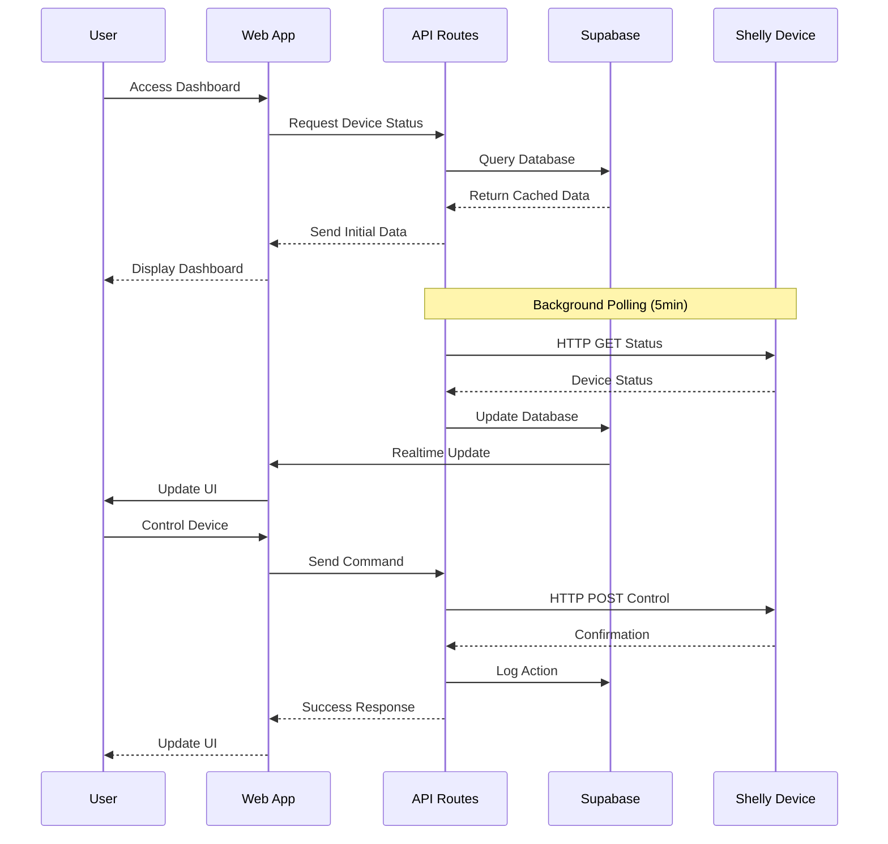
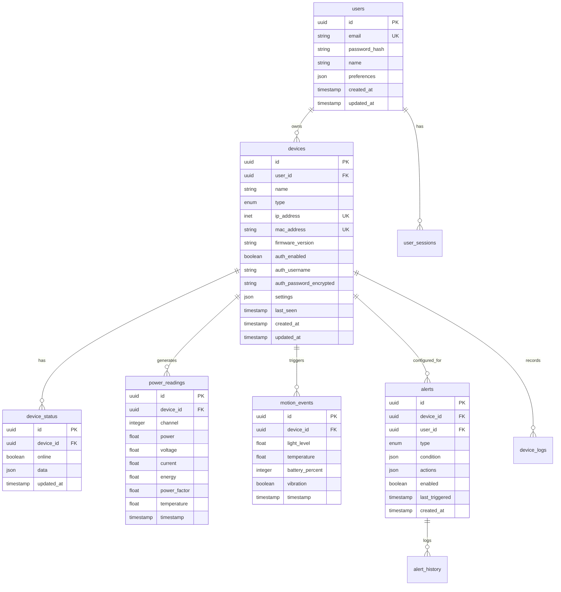
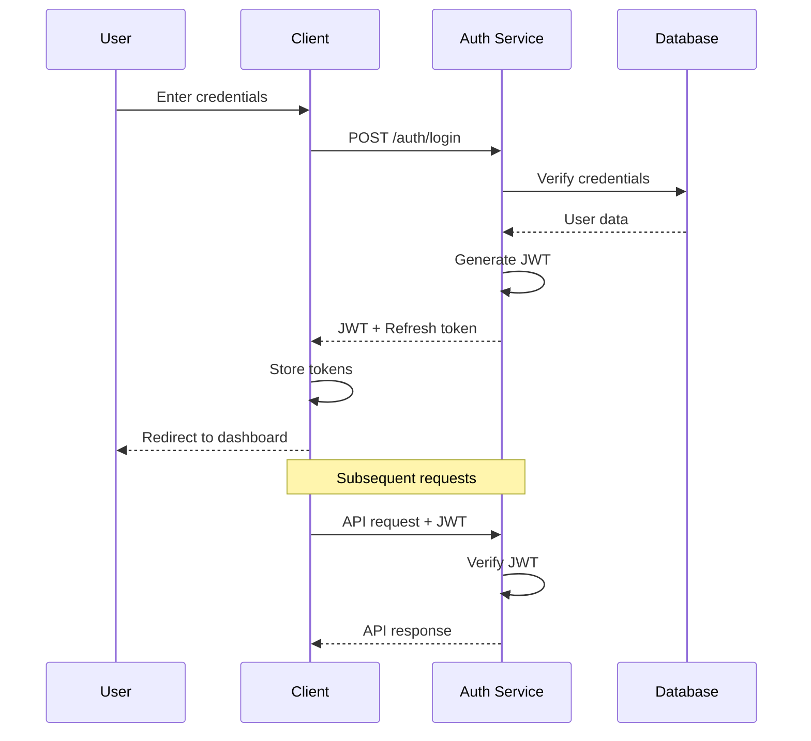
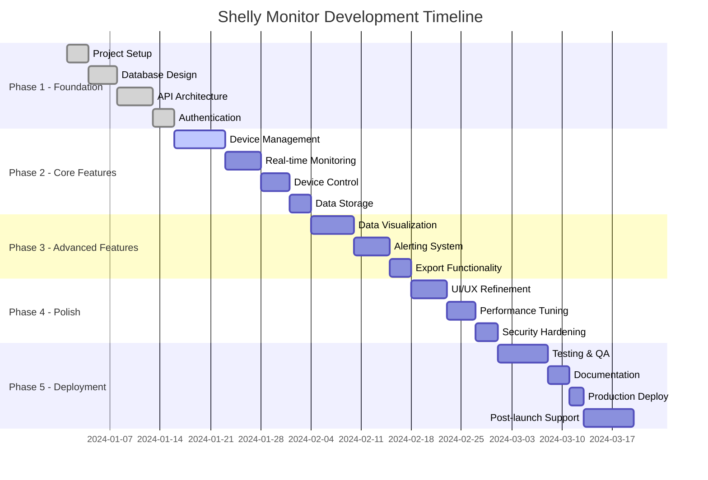

# Shelly Monitor Application - Technical Specification Document
## Version 1.0.0

---

## Table of Contents

1. [Executive Summary](#1-executive-summary)
2. [Project Overview](#2-project-overview)
3. [Technical Architecture](#3-technical-architecture)
4. [System Requirements](#4-system-requirements)
5. [API Specifications](#5-api-specifications)
6. [Database Schema](#6-database-schema)
7. [User Interface Specifications](#7-user-interface-specifications)
8. [Security Specifications](#8-security-specifications)
9. [Performance Requirements](#9-performance-requirements)
10. [Integration Specifications](#10-integration-specifications)
11. [Testing Strategy](#11-testing-strategy)
12. [Deployment Architecture](#12-deployment-architecture)
13. [Monitoring and Observability](#13-monitoring-and-observability)
14. [Error Handling and Recovery](#14-error-handling-and-recovery)
15. [Compliance and Standards](#15-compliance-and-standards)
16. [Project Timeline and Milestones](#16-project-timeline-and-milestones)
17. [Risk Assessment and Mitigation](#17-risk-assessment-and-mitigation)
18. [Appendices](#18-appendices)

---

## 1. Executive Summary

### 1.1 Purpose
The Shelly Monitor Application is a comprehensive IoT device monitoring and control system designed specifically for Shelly Plus 2PM and Shelly Motion 2 devices. This specification outlines the complete technical requirements, architecture, and implementation guidelines for developing a production-ready application.

### 1.2 Scope
- Real-time monitoring of Shelly IoT devices
- Remote control capabilities for Shelly Plus 2PM switches
- Historical data tracking and visualization
- Alert and notification system
- Cross-platform web application with mobile responsiveness
- Scalable architecture supporting 100+ devices

### 1.3 Key Stakeholders
- **End Users**: Homeowners and facility managers using Shelly devices
- **System Administrators**: Technical personnel managing the application
- **Development Team**: Engineers implementing the system
- **DevOps Team**: Personnel responsible for deployment and maintenance

---

## 2. Project Overview

### 2.1 Business Objectives
1. **Centralized Control**: Provide a single interface for all Shelly devices
2. **Energy Management**: Track and optimize power consumption
3. **Security Monitoring**: Real-time motion detection and alerts
4. **Data Intelligence**: Historical analysis and pattern recognition
5. **Automation**: Enable smart home/building automation scenarios

### 2.2 Technical Objectives
1. **Real-time Performance**: Sub-second response times for device control
2. **High Availability**: 99.9% uptime SLA
3. **Scalability**: Support for 1000+ concurrent users
4. **Data Integrity**: Zero data loss for sensor readings
5. **Security**: Enterprise-grade security implementation

### 2.3 Success Criteria
- Device response time < 500ms
- Dashboard load time < 2 seconds
- Zero critical security vulnerabilities
- 95% user satisfaction rate
- Support for 100+ devices per account

---

## 3. Technical Architecture

### 3.1 System Architecture Overview

```
┌─────────────────────────────────────────────────────────────────┐
│                        Client Layer                              │
├─────────────────┬──────────────────┬────────────────────────────┤
│   Web Browser   │  Mobile Browser  │    PWA Installation       │
│   (Desktop)     │  (Responsive)    │    (iOS/Android)          │
└────────┬────────┴──────────────────┴────────────┬───────────────┘
         │                                         │
         │              HTTPS/WSS                  │
         ▼                                         ▼
┌─────────────────────────────────────────────────────────────────┐
│                    Application Layer (Vercel)                    │
├─────────────────┬──────────────────┬────────────────────────────┤
│   Next.js App   │  API Routes      │    Edge Functions         │
│   (React SSR)   │  (Serverless)    │    (Middleware)           │
└────────┬────────┴──────────────────┴────────────┬───────────────┘
         │                                         │
         │           Supabase Client               │
         ▼                                         ▼
┌─────────────────────────────────────────────────────────────────┐
│                      Data Layer (Supabase)                       │
├─────────────────┬──────────────────┬────────────────────────────┤
│   PostgreSQL    │   Realtime       │    Auth Service           │
│   (Primary DB)  │   (WebSockets)   │    (User Management)      │
└────────┬────────┴──────────────────┴────────────┬───────────────┘
         │                                         │
         │              HTTP/HTTPS                 │
         ▼                                         ▼
┌─────────────────────────────────────────────────────────────────┐
│                        Device Layer                              │
├─────────────────┬──────────────────┬────────────────────────────┤
│ Shelly Plus 2PM │ Shelly Motion 2  │    Future Devices         │
│   (Gen2+ API)   │   (Gen2+ API)    │    (Compatible)           │
└─────────────────┴──────────────────┴────────────────────────────┘
```

### 3.2 Technology Stack

#### 3.2.1 Frontend
- **Framework**: Next.js 14+ (App Router)
- **UI Library**: React 18+
- **Design System**: Material UI v5 (Material Design 3)
- **State Management**: Zustand / React Context
- **Data Fetching**: SWR / React Query
- **Charts**: Recharts / Victory
- **TypeScript**: 5.0+
- **Styling**: Emotion + Tailwind CSS
- **Build Tool**: Turbopack (Next.js)

#### 3.2.2 Backend
- **Runtime**: Node.js 20+ LTS
- **API Framework**: Next.js API Routes (Serverless)
- **Database ORM**: Supabase Client
- **Validation**: Zod
- **Authentication**: Supabase Auth
- **Cron Jobs**: Vercel Cron
- **Edge Functions**: Vercel Edge Runtime

#### 3.2.3 Infrastructure
- **Hosting**: Vercel (Production)
- **Database**: Supabase (PostgreSQL)
- **CDN**: Vercel Edge Network
- **Monitoring**: Vercel Analytics + Sentry
- **CI/CD**: GitHub Actions + Vercel

### 3.3 Data Flow Architecture



---

## 4. System Requirements

### 4.1 Functional Requirements

#### 4.1.1 Device Management (MUST HAVE)
- **FR-DM-001**: System shall auto-discover Shelly devices on local network
- **FR-DM-002**: System shall support manual device addition via IP address
- **FR-DM-003**: System shall maintain device inventory with metadata
- **FR-DM-004**: System shall support device grouping and categorization
- **FR-DM-005**: System shall allow device renaming and configuration

#### 4.1.2 Monitoring (MUST HAVE)
- **FR-MON-001**: System shall display real-time device status
- **FR-MON-002**: System shall update device status within 5 seconds
- **FR-MON-003**: System shall show power consumption for Plus 2PM
- **FR-MON-004**: System shall display motion events for Motion 2
- **FR-MON-005**: System shall track device online/offline status

#### 4.1.3 Control (MUST HAVE)
- **FR-CTL-001**: System shall control Plus 2PM switches remotely
- **FR-CTL-002**: System shall provide switch toggle confirmation
- **FR-CTL-003**: System shall support scheduling for switches
- **FR-CTL-004**: System shall implement control access permissions
- **FR-CTL-005**: System shall log all control actions

#### 4.1.4 Data Management (MUST HAVE)
- **FR-DAT-001**: System shall store 90 days of historical data
- **FR-DAT-002**: System shall aggregate data for performance
- **FR-DAT-003**: System shall provide data export functionality
- **FR-DAT-004**: System shall implement data retention policies
- **FR-DAT-005**: System shall backup critical data daily

#### 4.1.5 Visualization (SHOULD HAVE)
- **FR-VIS-001**: System shall display power usage graphs
- **FR-VIS-002**: System shall show motion activity heatmaps
- **FR-VIS-003**: System shall provide customizable dashboards
- **FR-VIS-004**: System shall support multiple time ranges
- **FR-VIS-005**: System shall allow chart data export

#### 4.1.6 Alerts (SHOULD HAVE)
- **FR-ALT-001**: System shall send device offline alerts
- **FR-ALT-002**: System shall notify on motion detection
- **FR-ALT-003**: System shall alert on power thresholds
- **FR-ALT-004**: System shall support email notifications
- **FR-ALT-005**: System shall allow alert customization

#### 4.1.7 User Management (NICE TO HAVE)
- **FR-USR-001**: System shall support user authentication
- **FR-USR-002**: System shall implement role-based access
- **FR-USR-003**: System shall allow user profile management
- **FR-USR-004**: System shall support multi-tenancy
- **FR-USR-005**: System shall track user activity

### 4.2 Non-Functional Requirements

#### 4.2.1 Performance
- **NFR-PRF-001**: Page load time < 2 seconds (First Contentful Paint)
- **NFR-PRF-002**: API response time < 200ms (95th percentile)
- **NFR-PRF-003**: Device control latency < 500ms
- **NFR-PRF-004**: Support 100+ devices per user
- **NFR-PRF-005**: Handle 1000+ concurrent users

#### 4.2.2 Reliability
- **NFR-REL-001**: System uptime > 99.9%
- **NFR-REL-002**: Zero data loss for sensor readings
- **NFR-REL-003**: Automatic failure recovery
- **NFR-REL-004**: Graceful degradation on partial failure
- **NFR-REL-005**: Device polling retry mechanism

#### 4.2.3 Security
- **NFR-SEC-001**: HTTPS/TLS 1.3 for all communications
- **NFR-SEC-002**: Encrypted storage for credentials
- **NFR-SEC-003**: OWASP Top 10 compliance
- **NFR-SEC-004**: Rate limiting on all APIs
- **NFR-SEC-005**: Security audit logging

#### 4.2.4 Usability
- **NFR-USB-001**: Mobile-first responsive design
- **NFR-USB-002**: WCAG 2.1 AA accessibility
- **NFR-USB-003**: Intuitive navigation (3-click rule)
- **NFR-USB-004**: Multi-language support ready
- **NFR-USB-005**: Consistent UI/UX patterns

#### 4.2.5 Scalability
- **NFR-SCL-001**: Horizontal scaling capability
- **NFR-SCL-002**: Database partitioning support
- **NFR-SCL-003**: CDN integration for assets
- **NFR-SCL-004**: Microservices-ready architecture
- **NFR-SCL-005**: Load balancing support

---

## 5. API Specifications

### 5.1 RESTful API Design Principles
- Resource-based URLs
- HTTP methods for operations
- JSON request/response format
- Consistent error handling
- API versioning support

### 5.2 API Endpoints

#### 5.2.1 Device Management APIs

```typescript
// GET /api/v1/devices
// List all devices
interface ListDevicesResponse {
  devices: Device[];
  total: number;
  page: number;
  pageSize: number;
}

// POST /api/v1/devices
// Add new device
interface AddDeviceRequest {
  name: string;
  type: 'plus_2pm' | 'motion_2';
  ip_address: string;
  auth_enabled?: boolean;
  auth_username?: string;
  auth_password?: string;
}

// GET /api/v1/devices/:id
// Get device details
interface GetDeviceResponse {
  device: Device;
  status: DeviceStatus;
  lastSeen: Date;
}

// PUT /api/v1/devices/:id
// Update device
interface UpdateDeviceRequest {
  name?: string;
  settings?: DeviceSettings;
}

// DELETE /api/v1/devices/:id
// Remove device
interface DeleteDeviceResponse {
  success: boolean;
  message: string;
}

// POST /api/v1/devices/:id/control
// Control device (Plus 2PM only)
interface ControlDeviceRequest {
  action: 'switch';
  channel: 0 | 1;
  state: boolean;
}

// GET /api/v1/devices/:id/status
// Get real-time status
interface DeviceStatusResponse {
  online: boolean;
  data: ShellyPlus2PMStatus | ShellyMotion2Status;
  timestamp: Date;
}
```

#### 5.2.2 Data APIs

```typescript
// GET /api/v1/data/power
// Get power consumption data
interface PowerDataRequest {
  deviceIds?: string[];
  startDate: Date;
  endDate: Date;
  aggregation?: 'minute' | 'hour' | 'day';
}

// GET /api/v1/data/motion
// Get motion events
interface MotionDataRequest {
  deviceIds?: string[];
  startDate: Date;
  endDate: Date;
  limit?: number;
}

// GET /api/v1/data/export
// Export data
interface ExportDataRequest {
  type: 'power' | 'motion' | 'all';
  format: 'csv' | 'json';
  startDate: Date;
  endDate: Date;
}
```

#### 5.2.3 Alert APIs

```typescript
// GET /api/v1/alerts
// List alert configurations
interface ListAlertsResponse {
  alerts: Alert[];
  total: number;
}

// POST /api/v1/alerts
// Create alert
interface CreateAlertRequest {
  deviceId: string;
  type: 'offline' | 'motion' | 'power_threshold';
  condition: AlertCondition;
  actions: AlertAction[];
}

// PUT /api/v1/alerts/:id
// Update alert
interface UpdateAlertRequest {
  enabled?: boolean;
  condition?: AlertCondition;
  actions?: AlertAction[];
}

// DELETE /api/v1/alerts/:id
// Delete alert
```

### 5.3 WebSocket Events

```typescript
// Realtime event types
enum RealtimeEvent {
  DEVICE_STATUS_UPDATE = 'device.status.update',
  DEVICE_OFFLINE = 'device.offline',
  DEVICE_ONLINE = 'device.online',
  MOTION_DETECTED = 'motion.detected',
  POWER_THRESHOLD = 'power.threshold',
  SYSTEM_ALERT = 'system.alert'
}

// Event payload structure
interface RealtimePayload<T> {
  event: RealtimeEvent;
  timestamp: Date;
  data: T;
}
```

### 5.4 Error Handling

```typescript
// Standard error response
interface ErrorResponse {
  error: {
    code: string;
    message: string;
    details?: any;
    timestamp: Date;
    requestId: string;
  };
}

// Error codes
enum ErrorCode {
  // Client errors (4xx)
  INVALID_REQUEST = 'INVALID_REQUEST',
  UNAUTHORIZED = 'UNAUTHORIZED',
  FORBIDDEN = 'FORBIDDEN',
  NOT_FOUND = 'NOT_FOUND',
  RATE_LIMITED = 'RATE_LIMITED',
  
  // Server errors (5xx)
  INTERNAL_ERROR = 'INTERNAL_ERROR',
  SERVICE_UNAVAILABLE = 'SERVICE_UNAVAILABLE',
  DEVICE_UNREACHABLE = 'DEVICE_UNREACHABLE',
  DATABASE_ERROR = 'DATABASE_ERROR'
}
```

---

## 6. Database Schema

### 6.1 Entity Relationship Diagram



### 6.2 Database Tables

#### 6.2.1 Users Table
```sql
CREATE TABLE users (
    id UUID PRIMARY KEY DEFAULT gen_random_uuid(),
    email VARCHAR(255) UNIQUE NOT NULL,
    password_hash VARCHAR(255) NOT NULL,
    name VARCHAR(255),
    preferences JSONB DEFAULT '{}',
    created_at TIMESTAMPTZ DEFAULT NOW(),
    updated_at TIMESTAMPTZ DEFAULT NOW()
);

CREATE INDEX idx_users_email ON users(email);
```

#### 6.2.2 Devices Table
```sql
CREATE TABLE devices (
    id UUID PRIMARY KEY DEFAULT gen_random_uuid(),
    user_id UUID REFERENCES users(id) ON DELETE CASCADE,
    name VARCHAR(255) NOT NULL,
    type VARCHAR(50) CHECK (type IN ('plus_2pm', 'motion_2')) NOT NULL,
    ip_address INET NOT NULL,
    mac_address VARCHAR(17) UNIQUE,
    firmware_version VARCHAR(50),
    auth_enabled BOOLEAN DEFAULT false,
    auth_username VARCHAR(255),
    auth_password_encrypted TEXT,
    settings JSONB DEFAULT '{}',
    last_seen TIMESTAMPTZ,
    created_at TIMESTAMPTZ DEFAULT NOW(),
    updated_at TIMESTAMPTZ DEFAULT NOW(),
    UNIQUE(user_id, ip_address)
);

CREATE INDEX idx_devices_user_id ON devices(user_id);
CREATE INDEX idx_devices_type ON devices(type);
CREATE INDEX idx_devices_last_seen ON devices(last_seen);
```

#### 6.2.3 Device Status Table
```sql
CREATE TABLE device_status (
    id UUID PRIMARY KEY DEFAULT gen_random_uuid(),
    device_id UUID REFERENCES devices(id) ON DELETE CASCADE,
    online BOOLEAN DEFAULT false,
    data JSONB NOT NULL,
    updated_at TIMESTAMPTZ DEFAULT NOW(),
    UNIQUE(device_id)
);

CREATE INDEX idx_device_status_device_id ON device_status(device_id);
CREATE INDEX idx_device_status_updated_at ON device_status(updated_at);
```

#### 6.2.4 Power Readings Table
```sql
CREATE TABLE power_readings (
    id UUID PRIMARY KEY DEFAULT gen_random_uuid(),
    device_id UUID REFERENCES devices(id) ON DELETE CASCADE,
    channel INTEGER CHECK (channel IN (0, 1)) NOT NULL,
    power FLOAT,
    voltage FLOAT,
    current FLOAT,
    energy FLOAT,
    power_factor FLOAT,
    temperature FLOAT,
    timestamp TIMESTAMPTZ DEFAULT NOW()
) PARTITION BY RANGE (timestamp);

-- Create monthly partitions
CREATE TABLE power_readings_2024_01 PARTITION OF power_readings
    FOR VALUES FROM ('2024-01-01') TO ('2024-02-01');
    
CREATE INDEX idx_power_readings_device_timestamp 
    ON power_readings(device_id, timestamp DESC);
CREATE INDEX idx_power_readings_timestamp 
    ON power_readings(timestamp DESC);
```

#### 6.2.5 Motion Events Table
```sql
CREATE TABLE motion_events (
    id UUID PRIMARY KEY DEFAULT gen_random_uuid(),
    device_id UUID REFERENCES devices(id) ON DELETE CASCADE,
    light_level FLOAT,
    temperature FLOAT,
    battery_percent INTEGER,
    vibration BOOLEAN DEFAULT false,
    timestamp TIMESTAMPTZ DEFAULT NOW()
) PARTITION BY RANGE (timestamp);

-- Create monthly partitions
CREATE TABLE motion_events_2024_01 PARTITION OF motion_events
    FOR VALUES FROM ('2024-01-01') TO ('2024-02-01');
    
CREATE INDEX idx_motion_events_device_timestamp 
    ON motion_events(device_id, timestamp DESC);
CREATE INDEX idx_motion_events_timestamp 
    ON motion_events(timestamp DESC);
```

#### 6.2.6 Alerts Table
```sql
CREATE TABLE alerts (
    id UUID PRIMARY KEY DEFAULT gen_random_uuid(),
    device_id UUID REFERENCES devices(id) ON DELETE CASCADE,
    user_id UUID REFERENCES users(id) ON DELETE CASCADE,
    type VARCHAR(50) NOT NULL,
    condition JSONB NOT NULL,
    actions JSONB NOT NULL DEFAULT '[]',
    enabled BOOLEAN DEFAULT true,
    last_triggered TIMESTAMPTZ,
    created_at TIMESTAMPTZ DEFAULT NOW(),
    updated_at TIMESTAMPTZ DEFAULT NOW()
);

CREATE INDEX idx_alerts_device_id ON alerts(device_id);
CREATE INDEX idx_alerts_user_id ON alerts(user_id);
CREATE INDEX idx_alerts_enabled ON alerts(enabled);
```

### 6.3 Data Retention Policies

```sql
-- Automated data retention function
CREATE OR REPLACE FUNCTION cleanup_old_data() RETURNS void AS $$
BEGIN
    -- Delete power readings older than 90 days
    DELETE FROM power_readings 
    WHERE timestamp < NOW() - INTERVAL '90 days';
    
    -- Delete motion events older than 90 days
    DELETE FROM motion_events 
    WHERE timestamp < NOW() - INTERVAL '90 days';
    
    -- Archive device logs older than 30 days
    INSERT INTO device_logs_archive 
    SELECT * FROM device_logs 
    WHERE created_at < NOW() - INTERVAL '30 days';
    
    DELETE FROM device_logs 
    WHERE created_at < NOW() - INTERVAL '30 days';
END;
$$ LANGUAGE plpgsql;

-- Schedule cleanup job
SELECT cron.schedule('cleanup-old-data', '0 2 * * *', 'SELECT cleanup_old_data()');
```

---

## 7. User Interface Specifications

### 7.1 Design System

#### 7.1.1 Color Palette
```scss
// Primary Colors
$primary-50: #E3F2FD;
$primary-100: #BBDEFB;
$primary-200: #90CAF9;
$primary-300: #64B5F6;
$primary-400: #42A5F5;
$primary-500: #2196F3; // Main
$primary-600: #1E88E5;
$primary-700: #1976D2;
$primary-800: #1565C0;
$primary-900: #0D47A1;

// Secondary Colors
$secondary-50: #FCE4EC;
$secondary-100: #F8BBD0;
$secondary-200: #F48FB1;
$secondary-300: #F06292;
$secondary-400: #EC407A;
$secondary-500: #E91E63; // Main
$secondary-600: #D81B60;
$secondary-700: #C2185B;
$secondary-800: #AD1457;
$secondary-900: #880E4F;

// Semantic Colors
$success: #4CAF50;
$warning: #FF9800;
$error: #F44336;
$info: #2196F3;

// Neutral Colors
$gray-50: #FAFAFA;
$gray-100: #F5F5F5;
$gray-200: #EEEEEE;
$gray-300: #E0E0E0;
$gray-400: #BDBDBD;
$gray-500: #9E9E9E;
$gray-600: #757575;
$gray-700: #616161;
$gray-800: #424242;
$gray-900: #212121;
```

#### 7.1.2 Typography
```scss
// Font Family
$font-primary: 'Roboto', -apple-system, BlinkMacSystemFont, 'Segoe UI', sans-serif;
$font-mono: 'Roboto Mono', 'Monaco', 'Courier New', monospace;

// Font Sizes
$text-xs: 0.75rem;    // 12px
$text-sm: 0.875rem;   // 14px
$text-base: 1rem;     // 16px
$text-lg: 1.125rem;   // 18px
$text-xl: 1.25rem;    // 20px
$text-2xl: 1.5rem;    // 24px
$text-3xl: 1.875rem;  // 30px
$text-4xl: 2.25rem;   // 36px

// Font Weights
$font-light: 300;
$font-regular: 400;
$font-medium: 500;
$font-semibold: 600;
$font-bold: 700;

// Line Heights
$leading-tight: 1.25;
$leading-normal: 1.5;
$leading-relaxed: 1.75;
```

#### 7.1.3 Spacing System
```scss
// Spacing Scale (4px base)
$space-1: 0.25rem;   // 4px
$space-2: 0.5rem;    // 8px
$space-3: 0.75rem;   // 12px
$space-4: 1rem;      // 16px
$space-5: 1.25rem;   // 20px
$space-6: 1.5rem;    // 24px
$space-8: 2rem;      // 32px
$space-10: 2.5rem;   // 40px
$space-12: 3rem;     // 48px
$space-16: 4rem;     // 64px
```

### 7.2 Component Library

#### 7.2.1 Core Components
```typescript
// Button Component
interface ButtonProps {
  variant: 'contained' | 'outlined' | 'text';
  color: 'primary' | 'secondary' | 'error' | 'warning' | 'info' | 'success';
  size: 'small' | 'medium' | 'large';
  disabled?: boolean;
  loading?: boolean;
  fullWidth?: boolean;
  startIcon?: ReactNode;
  endIcon?: ReactNode;
  onClick?: () => void;
}

// Card Component
interface CardProps {
  variant: 'elevated' | 'outlined' | 'filled';
  padding?: 'none' | 'small' | 'medium' | 'large';
  interactive?: boolean;
  selected?: boolean;
}

// Input Component
interface InputProps {
  type: 'text' | 'email' | 'password' | 'number' | 'search';
  variant: 'outlined' | 'filled' | 'standard';
  size: 'small' | 'medium';
  error?: boolean;
  helperText?: string;
  startAdornment?: ReactNode;
  endAdornment?: ReactNode;
}
```

#### 7.2.2 Custom Components
```typescript
// DeviceCard Component
interface DeviceCardProps {
  device: Device;
  status: DeviceStatus;
  onControl?: (action: ControlAction) => void;
  onEdit?: () => void;
  onDelete?: () => void;
  compact?: boolean;
}

// PowerChart Component
interface PowerChartProps {
  data: PowerReading[];
  timeRange: '1h' | '24h' | '7d' | '30d';
  aggregation: 'minute' | 'hour' | 'day';
  devices?: Device[];
  height?: number;
}

// MotionHeatmap Component
interface MotionHeatmapProps {
  data: MotionEvent[];
  device: Device;
  days?: number;
  hourlyBreakdown?: boolean;
}

// StatusIndicator Component
interface StatusIndicatorProps {
  status: 'online' | 'offline' | 'warning' | 'error';
  size?: 'small' | 'medium' | 'large';
  showLabel?: boolean;
  pulse?: boolean;
}
```

### 7.3 Page Layouts

#### 7.3.1 Dashboard Layout
```
┌─────────────────────────────────────────────────────────┐
│ Navigation Bar                                          │
├─────────────────────────────────────────────────────────┤
│ ┌─────────────────────────────────────────────────────┐ │
│ │ Page Header: Dashboard                              │ │
│ │ Subtitle: Real-time device monitoring               │ │
│ └─────────────────────────────────────────────────────┘ │
│                                                         │
│ ┌───────────┬───────────┬───────────┬───────────┐     │
│ │ Stat Card │ Stat Card │ Stat Card │ Stat Card │     │
│ │ Total     │ Online    │ Power     │ Motion    │     │
│ │ Devices   │ Devices   │ Usage     │ Events    │     │
│ └───────────┴───────────┴───────────┴───────────┘     │
│                                                         │
│ ┌─────────────────────────────────────────────────────┐ │
│ │ Device Grid (Responsive)                            │ │
│ │ ┌─────────┐ ┌─────────┐ ┌─────────┐ ┌─────────┐   │ │
│ │ │ Device  │ │ Device  │ │ Device  │ │ Device  │   │ │
│ │ │ Card    │ │ Card    │ │ Card    │ │ Card    │   │ │
│ │ └─────────┘ └─────────┘ └─────────┘ └─────────┘   │ │
│ └─────────────────────────────────────────────────────┘ │
│                                                         │
│ ┌─────────────────────────┬───────────────────────────┐ │
│ │ Power Usage Chart       │ Motion Activity Heatmap   │ │
│ │ (Line Chart)            │ (Grid Visualization)      │ │
│ └─────────────────────────┴───────────────────────────┘ │
└─────────────────────────────────────────────────────────┘
```

#### 7.3.2 Device Detail Layout
```
┌─────────────────────────────────────────────────────────┐
│ Navigation Bar                                          │
├─────────────────────────────────────────────────────────┤
│ ← Back to Devices                                       │
│                                                         │
│ ┌─────────────────────────────────────────────────────┐ │
│ │ Device Header                                       │ │
│ │ [Icon] Device Name            [Edit] [Delete]      │ │
│ │ Status: Online • Type: Plus 2PM • IP: 192.168.1.x  │ │
│ └─────────────────────────────────────────────────────┘ │
│                                                         │
│ ┌─────────────────────────┬───────────────────────────┐ │
│ │ Control Panel           │ Live Status              │ │
│ │ ┌─────────────────────┐ │ ┌─────────────────────┐  │ │
│ │ │ Channel 1      [□] │ │ │ Power: 125.5W      │  │ │
│ │ │ Living Room Light  │ │ │ Voltage: 230V      │  │ │
│ │ └─────────────────────┘ │ │ Current: 0.54A     │  │ │
│ │ ┌─────────────────────┐ │ │ Energy: 15.2kWh    │  │ │
│ │ │ Channel 2      [■] │ │ │ Temp: 45°C         │  │ │
│ │ │ Kitchen Light      │ │ └─────────────────────┘  │ │
│ │ └─────────────────────┘ │                          │ │
│ └─────────────────────────┴───────────────────────────┘ │
│                                                         │
│ ┌─────────────────────────────────────────────────────┐ │
│ │ Tab Navigation                                      │ │
│ │ [History] [Analytics] [Settings] [Alerts]          │ │
│ ├─────────────────────────────────────────────────────┤ │
│ │ Tab Content Area                                    │ │
│ └─────────────────────────────────────────────────────┘ │
└─────────────────────────────────────────────────────────┘
```

### 7.4 Responsive Design

#### 7.4.1 Breakpoints
```scss
// Breakpoint definitions
$breakpoint-xs: 0;      // Extra small devices (phones)
$breakpoint-sm: 640px;  // Small devices (landscape phones)
$breakpoint-md: 768px;  // Medium devices (tablets)
$breakpoint-lg: 1024px; // Large devices (desktops)
$breakpoint-xl: 1280px; // Extra large devices (large desktops)
$breakpoint-2xl: 1536px; // 2X large devices (larger desktops)
```

#### 7.4.2 Grid System
```scss
// Grid configuration
.container {
  width: 100%;
  margin: 0 auto;
  padding: 0 1rem;
  
  @media (min-width: $breakpoint-sm) {
    max-width: $breakpoint-sm;
  }
  
  @media (min-width: $breakpoint-md) {
    max-width: $breakpoint-md;
  }
  
  @media (min-width: $breakpoint-lg) {
    max-width: $breakpoint-lg;
    padding: 0 2rem;
  }
  
  @media (min-width: $breakpoint-xl) {
    max-width: $breakpoint-xl;
  }
}

// Grid columns
.grid {
  display: grid;
  gap: 1rem;
  
  // Mobile: 1 column
  grid-template-columns: 1fr;
  
  // Tablet: 2 columns
  @media (min-width: $breakpoint-md) {
    grid-template-columns: repeat(2, 1fr);
  }
  
  // Desktop: 3 columns
  @media (min-width: $breakpoint-lg) {
    grid-template-columns: repeat(3, 1fr);
  }
  
  // Large desktop: 4 columns
  @media (min-width: $breakpoint-xl) {
    grid-template-columns: repeat(4, 1fr);
  }
}
```

### 7.5 Accessibility Standards

#### 7.5.1 WCAG 2.1 AA Compliance
- **Color Contrast**: Minimum ratio of 4.5:1 for normal text
- **Keyboard Navigation**: All interactive elements keyboard accessible
- **Screen Reader**: Proper ARIA labels and semantic HTML
- **Focus Indicators**: Visible focus states for all elements
- **Error Messages**: Clear, descriptive error messages

#### 7.5.2 ARIA Implementation
```html
<!-- Device Card Example -->
<article 
  role="article" 
  aria-label="Device: Living Room Switch"
  aria-describedby="device-status-1"
>
  <header>
    <h3 id="device-name-1">Living Room Switch</h3>
    <span 
      id="device-status-1" 
      role="status" 
      aria-live="polite"
    >
      Status: Online
    </span>
  </header>
  
  <button 
    aria-label="Toggle Living Room Switch Channel 1"
    aria-pressed="true"
    onClick={handleToggle}
  >
    <span aria-hidden="true">💡</span>
    Channel 1: On
  </button>
</article>
```

---

## 8. Security Specifications

### 8.1 Authentication & Authorization

#### 8.1.1 Authentication Flow


#### 8.1.2 JWT Token Structure
```json
{
  "header": {
    "alg": "RS256",
    "typ": "JWT",
    "kid": "key-id"
  },
  "payload": {
    "sub": "user-uuid",
    "email": "user@example.com",
    "role": "user",
    "permissions": ["read:devices", "write:devices"],
    "iat": 1234567890,
    "exp": 1234571490,
    "iss": "shelly-monitor",
    "aud": "shelly-monitor-api"
  }
}
```

#### 8.1.3 Role-Based Access Control (RBAC)
```typescript
enum Role {
  ADMIN = 'admin',
  USER = 'user',
  VIEWER = 'viewer'
}

interface Permission {
  resource: string;
  actions: ('create' | 'read' | 'update' | 'delete')[];
}

const rolePermissions: Record<Role, Permission[]> = {
  [Role.ADMIN]: [
    { resource: 'devices', actions: ['create', 'read', 'update', 'delete'] },
    { resource: 'users', actions: ['create', 'read', 'update', 'delete'] },
    { resource: 'settings', actions: ['create', 'read', 'update', 'delete'] }
  ],
  [Role.USER]: [
    { resource: 'devices', actions: ['create', 'read', 'update', 'delete'] },
    { resource: 'users', actions: ['read', 'update'] }, // Own profile only
    { resource: 'settings', actions: ['read', 'update'] }
  ],
  [Role.VIEWER]: [
    { resource: 'devices', actions: ['read'] },
    { resource: 'users', actions: ['read'] }, // Own profile only
    { resource: 'settings', actions: ['read'] }
  ]
};
```

### 8.2 Data Security

#### 8.2.1 Encryption Standards
- **In Transit**: TLS 1.3 minimum for all communications
- **At Rest**: AES-256-GCM for sensitive data
- **Key Management**: AWS KMS or HashiCorp Vault
- **Password Hashing**: Argon2id with salt

#### 8.2.2 Sensitive Data Handling
```typescript
// Encryption service
class EncryptionService {
  private algorithm = 'aes-256-gcm';
  private keyDerivation = 'argon2id';
  
  async encryptField(plaintext: string, key: Buffer): Promise<EncryptedData> {
    const iv = crypto.randomBytes(16);
    const cipher = crypto.createCipheriv(this.algorithm, key, iv);
    
    let encrypted = cipher.update(plaintext, 'utf8', 'hex');
    encrypted += cipher.final('hex');
    
    const authTag = cipher.getAuthTag();
    
    return {
      encrypted,
      iv: iv.toString('hex'),
      authTag: authTag.toString('hex')
    };
  }
  
  async hashPassword(password: string): Promise<string> {
    return argon2.hash(password, {
      type: argon2.argon2id,
      memoryCost: 2 ** 16,
      timeCost: 3,
      parallelism: 1,
    });
  }
}
```

### 8.3 API Security

#### 8.3.1 Rate Limiting
```typescript
// Rate limit configuration
const rateLimits = {
  global: {
    windowMs: 15 * 60 * 1000, // 15 minutes
    max: 1000 // requests per window
  },
  auth: {
    windowMs: 15 * 60 * 1000,
    max: 5 // login attempts
  },
  api: {
    windowMs: 1 * 60 * 1000, // 1 minute
    max: 100 // API calls
  },
  control: {
    windowMs: 1 * 60 * 1000,
    max: 20 // device control actions
  }
};
```

#### 8.3.2 Input Validation
```typescript
// Zod schemas for validation
import { z } from 'zod';

const deviceSchema = z.object({
  name: z.string().min(1).max(255),
  type: z.enum(['plus_2pm', 'motion_2']),
  ip_address: z.string().ip({ version: 'v4' }),
  auth_enabled: z.boolean().optional(),
  auth_username: z.string().max(255).optional(),
  auth_password: z.string().min(8).max(128).optional()
});

const controlSchema = z.object({
  action: z.literal('switch'),
  channel: z.number().int().min(0).max(1),
  state: z.boolean()
});

// Sanitization
const sanitizeInput = (input: string): string => {
  return input
    .replace(/[<>]/g, '') // Remove potential HTML
    .replace(/[\x00-\x1F\x7F]/g, '') // Remove control characters
    .trim();
};
```

### 8.4 Infrastructure Security

#### 8.4.1 Network Security
- **WAF**: Cloudflare or AWS WAF
- **DDoS Protection**: Rate limiting + CDN
- **IP Whitelisting**: Optional for admin access
- **VPN**: Site-to-site for device communication

#### 8.4.2 Container Security
```dockerfile
# Secure Docker configuration
FROM node:20-alpine AS base

# Non-root user
RUN addgroup -g 1001 -S nodejs
RUN adduser -S nextjs -u 1001

# Security headers
ENV NODE_ENV=production
ENV NEXT_TELEMETRY_DISABLED=1

# Copy only necessary files
COPY --chown=nextjs:nodejs . .

# Run as non-root
USER nextjs

# Health check
HEALTHCHECK --interval=30s --timeout=3s --start-period=5s --retries=3 \
  CMD node healthcheck.js
```

### 8.5 Security Monitoring

#### 8.5.1 Audit Logging
```typescript
interface AuditLog {
  id: string;
  timestamp: Date;
  userId: string;
  action: string;
  resource: string;
  resourceId: string;
  ipAddress: string;
  userAgent: string;
  result: 'success' | 'failure';
  metadata?: Record<string, any>;
}

class AuditService {
  async log(entry: Omit<AuditLog, 'id' | 'timestamp'>): Promise<void> {
    const log: AuditLog = {
      id: uuidv4(),
      timestamp: new Date(),
      ...entry
    };
    
    // Store in database
    await db.auditLogs.create({ data: log });
    
    // Send to SIEM if configured
    if (process.env.SIEM_ENDPOINT) {
      await fetch(process.env.SIEM_ENDPOINT, {
        method: 'POST',
        body: JSON.stringify(log)
      });
    }
  }
}
```

#### 8.5.2 Security Alerts
```typescript
enum SecurityAlertType {
  MULTIPLE_FAILED_LOGINS = 'MULTIPLE_FAILED_LOGINS',
  SUSPICIOUS_ACTIVITY = 'SUSPICIOUS_ACTIVITY',
  UNAUTHORIZED_ACCESS = 'UNAUTHORIZED_ACCESS',
  DATA_BREACH_ATTEMPT = 'DATA_BREACH_ATTEMPT'
}

interface SecurityAlert {
  type: SecurityAlertType;
  severity: 'low' | 'medium' | 'high' | 'critical';
  description: string;
  affectedResources: string[];
  recommendedAction: string;
}
```

---

## 9. Performance Requirements

### 9.1 Performance Metrics

#### 9.1.1 Response Time Requirements
| Operation | Target | Maximum |
|-----------|--------|---------|
| Page Load (FCP) | < 1.5s | 2.5s |
| API Response | < 200ms | 500ms |
| Device Control | < 300ms | 500ms |
| Data Query | < 500ms | 1s |
| Export Generation | < 5s | 30s |

#### 9.1.2 Throughput Requirements
| Metric | Requirement |
|--------|-------------|
| Concurrent Users | 1,000+ |
| Requests per Second | 5,000 RPS |
| WebSocket Connections | 10,000 |
| Data Ingestion | 1M points/hour |

### 9.2 Performance Optimization

#### 9.2.1 Frontend Optimization
```typescript
// Code splitting
const DeviceDetail = lazy(() => import('./pages/DeviceDetail'));

// Image optimization
import Image from 'next/image';

// Memoization
const ExpensiveComponent = memo(({ data }) => {
  const processedData = useMemo(() => 
    processData(data), [data]
  );
  
  return <Chart data={processedData} />;
});

// Virtual scrolling for large lists
import { FixedSizeList } from 'react-window';

const DeviceList = ({ devices }) => (
  <FixedSizeList
    height={600}
    width="100%"
    itemCount={devices.length}
    itemSize={80}
  >
    {({ index, style }) => (
      <DeviceRow 
        device={devices[index]} 
        style={style} 
      />
    )}
  </FixedSizeList>
);
```

#### 9.2.2 Backend Optimization
```typescript
// Database query optimization
class DeviceRepository {
  async getDevicesWithStatus(userId: string) {
    return db.$queryRaw`
      SELECT 
        d.*,
        ds.online,
        ds.data,
        ds.updated_at as status_updated_at
      FROM devices d
      LEFT JOIN device_status ds ON d.id = ds.device_id
      WHERE d.user_id = ${userId}
      ORDER BY d.created_at DESC
    `;
  }
  
  // Connection pooling
  private pool = new Pool({
    max: 20,
    idleTimeoutMillis: 30000,
    connectionTimeoutMillis: 2000,
  });
}

// Caching strategy
class CacheService {
  private redis: Redis;
  
  async get<T>(key: string): Promise<T | null> {
    const cached = await this.redis.get(key);
    return cached ? JSON.parse(cached) : null;
  }
  
  async set(key: string, value: any, ttl = 300): Promise<void> {
    await this.redis.setex(key, ttl, JSON.stringify(value));
  }
  
  async invalidate(pattern: string): Promise<void> {
    const keys = await this.redis.keys(pattern);
    if (keys.length) {
      await this.redis.del(...keys);
    }
  }
}
```

### 9.3 Scalability Architecture

#### 9.3.1 Horizontal Scaling
```yaml
# Kubernetes deployment
apiVersion: apps/v1
kind: Deployment
metadata:
  name: shelly-monitor-api
spec:
  replicas: 3
  selector:
    matchLabels:
      app: shelly-monitor-api
  template:
    metadata:
      labels:
        app: shelly-monitor-api
    spec:
      containers:
      - name: api
        image: shelly-monitor:latest
        resources:
          requests:
            memory: "256Mi"
            cpu: "250m"
          limits:
            memory: "512Mi"
            cpu: "500m"
        livenessProbe:
          httpGet:
            path: /health
            port: 3000
          initialDelaySeconds: 30
          periodSeconds: 10
```

#### 9.3.2 Load Balancing
```nginx
# Nginx configuration
upstream api_servers {
    least_conn;
    server api1.internal:3000 weight=10 max_fails=3 fail_timeout=30s;
    server api2.internal:3000 weight=10 max_fails=3 fail_timeout=30s;
    server api3.internal:3000 weight=10 max_fails=3 fail_timeout=30s;
    
    keepalive 32;
}

server {
    listen 80;
    server_name api.shellymonitor.com;
    
    location / {
        proxy_pass http://api_servers;
        proxy_http_version 1.1;
        proxy_set_header Connection "";
        proxy_set_header Host $host;
        proxy_set_header X-Real-IP $remote_addr;
        proxy_buffering off;
    }
}
```

---

## 10. Integration Specifications

### 10.1 Shelly Device Integration

#### 10.1.1 Device Discovery Protocol
```typescript
class DeviceDiscovery {
  private mdns: MulticastDNS;
  
  async discoverDevices(): Promise<DiscoveredDevice[]> {
    const devices: DiscoveredDevice[] = [];
    
    // mDNS discovery
    this.mdns.on('response', (response) => {
      response.answers.forEach(answer => {
        if (answer.name.includes('shelly')) {
          devices.push({
            name: answer.name,
            ip: answer.data,
            type: this.detectDeviceType(answer.name)
          });
        }
      });
    });
    
    // Query for Shelly devices
    this.mdns.query({
      questions: [{
        name: '_http._tcp.local',
        type: 'PTR'
      }]
    });
    
    // Also scan IP range
    const subnet = await this.getLocalSubnet();
    const rangeDevices = await this.scanIPRange(subnet);
    
    return [...devices, ...rangeDevices];
  }
}
```

#### 10.1.2 Device Communication Layer
```typescript
interface ShellyAPI {
  // Gen2+ RPC Methods
  getStatus(): Promise<DeviceStatus>;
  getDeviceInfo(): Promise<DeviceInfo>;
  getConfig(): Promise<DeviceConfig>;
  setConfig(config: Partial<DeviceConfig>): Promise<void>;
  
  // Switch specific (Plus 2PM)
  switchSet(id: number, on: boolean): Promise<void>;
  switchGetStatus(id: number): Promise<SwitchStatus>;
  switchSetConfig(id: number, config: SwitchConfig): Promise<void>;
  
  // Schedule management
  scheduleCreate(schedule: Schedule): Promise<number>;
  scheduleUpdate(id: number, schedule: Partial<Schedule>): Promise<void>;
  scheduleDelete(id: number): Promise<void>;
  scheduleList(): Promise<Schedule[]>;
  
  // Webhook management
  webhookCreate(webhook: Webhook): Promise<number>;
  webhookUpdate(id: number, webhook: Partial<Webhook>): Promise<void>;
  webhookDelete(id: number): Promise<void>;
  webhookList(): Promise<Webhook[]>;
}

class ShellyAPIClient implements ShellyAPI {
  constructor(
    private ip: string,
    private auth?: { username: string; password: string }
  ) {}
  
  private async rpcCall(method: string, params?: any): Promise<any> {
    const response = await fetch(`http://${this.ip}/rpc`, {
      method: 'POST',
      headers: {
        'Content-Type': 'application/json',
        ...(this.auth && {
          'Authorization': 'Basic ' + btoa(`${this.auth.username}:${this.auth.password}`)
        })
      },
      body: JSON.stringify({
        id: Date.now(),
        method,
        params
      })
    });
    
    const result = await response.json();
    if (result.error) {
      throw new ShellyAPIError(result.error);
    }
    
    return result.result;
  }
  
  async getStatus(): Promise<DeviceStatus> {
    return this.rpcCall('Shelly.GetStatus');
  }
  
  // ... implement other methods
}
```

### 10.2 Third-Party Integrations

#### 10.2.1 Notification Services
```typescript
// Email integration (SendGrid)
class EmailService {
  private sg = require('@sendgrid/mail');
  
  constructor() {
    this.sg.setApiKey(process.env.SENDGRID_API_KEY);
  }
  
  async sendAlert(alert: Alert, recipient: string): Promise<void> {
    const msg = {
      to: recipient,
      from: 'alerts@shellymonitor.com',
      subject: `Alert: ${alert.title}`,
      text: alert.message,
      html: this.generateAlertHTML(alert)
    };
    
    await this.sg.send(msg);
  }
}

// Push notifications (Web Push)
class PushNotificationService {
  async sendNotification(
    subscription: PushSubscription,
    payload: NotificationPayload
  ): Promise<void> {
    await webpush.sendNotification(
      subscription,
      JSON.stringify(payload),
      {
        vapidDetails: {
          subject: 'mailto:admin@shellymonitor.com',
          publicKey: process.env.VAPID_PUBLIC_KEY,
          privateKey: process.env.VAPID_PRIVATE_KEY
        }
      }
    );
  }
}

// SMS integration (Twilio)
class SMSService {
  private twilio = require('twilio')(
    process.env.TWILIO_ACCOUNT_SID,
    process.env.TWILIO_AUTH_TOKEN
  );
  
  async sendSMS(to: string, message: string): Promise<void> {
    await this.twilio.messages.create({
      body: message,
      from: process.env.TWILIO_PHONE_NUMBER,
      to
    });
  }
}
```

#### 10.2.2 Home Automation Platforms
```typescript
// IFTTT Integration
class IFTTTService {
  async triggerEvent(
    eventName: string,
    values: Record<string, any>
  ): Promise<void> {
    await fetch(
      `https://maker.ifttt.com/trigger/${eventName}/with/key/${process.env.IFTTT_KEY}`,
      {
        method: 'POST',
        headers: { 'Content-Type': 'application/json' },
        body: JSON.stringify({ value1: values })
      }
    );
  }
}

// Home Assistant Integration
class HomeAssistantService {
  private hassUrl = process.env.HASS_URL;
  private hassToken = process.env.HASS_TOKEN;
  
  async createEntity(entity: HAEntity): Promise<void> {
    await fetch(`${this.hassUrl}/api/states/${entity.id}`, {
      method: 'POST',
      headers: {
        'Authorization': `Bearer ${this.hassToken}`,
        'Content-Type': 'application/json'
      },
      body: JSON.stringify({
        state: entity.state,
        attributes: entity.attributes
      })
    });
  }
  
  async updateEntity(
    entityId: string,
    state: any,
    attributes?: Record<string, any>
  ): Promise<void> {
    await this.createEntity({
      id: entityId,
      state,
      attributes
    });
  }
}
```

### 10.3 Export/Import Capabilities

#### 10.3.1 Data Export Formats
```typescript
interface ExportService {
  exportDevices(format: 'json' | 'csv'): Promise<Buffer>;
  exportPowerData(
    deviceIds: string[],
    dateRange: DateRange,
    format: 'json' | 'csv' | 'xlsx'
  ): Promise<Buffer>;
  exportMotionEvents(
    deviceIds: string[],
    dateRange: DateRange,
    format: 'json' | 'csv'
  ): Promise<Buffer>;
}

class DataExportService implements ExportService {
  async exportPowerData(
    deviceIds: string[],
    dateRange: DateRange,
    format: 'json' | 'csv' | 'xlsx'
  ): Promise<Buffer> {
    const data = await this.fetchPowerData(deviceIds, dateRange);
    
    switch (format) {
      case 'json':
        return Buffer.from(JSON.stringify(data, null, 2));
        
      case 'csv':
        const csv = this.convertToCSV(data);
        return Buffer.from(csv);
        
      case 'xlsx':
        const workbook = new ExcelJS.Workbook();
        const worksheet = workbook.addWorksheet('Power Data');
        
        // Add headers
        worksheet.columns = [
          { header: 'Timestamp', key: 'timestamp', width: 20 },
          { header: 'Device', key: 'device', width: 30 },
          { header: 'Channel', key: 'channel', width: 10 },
          { header: 'Power (W)', key: 'power', width: 15 },
          { header: 'Energy (kWh)', key: 'energy', width: 15 }
        ];
        
        // Add data
        worksheet.addRows(data);
        
        return workbook.xlsx.writeBuffer();
    }
  }
}
```

---

## 11. Testing Strategy

### 11.1 Testing Levels

#### 11.1.1 Unit Testing
```typescript
// Jest configuration
module.exports = {
  preset: 'ts-jest',
  testEnvironment: 'node',
  coverageThreshold: {
    global: {
      branches: 80,
      functions: 80,
      lines: 80,
      statements: 80
    }
  },
  moduleNameMapper: {
    '^@/(.*)$': '<rootDir>/src/$1'
  }
};

// Example unit test
describe('ShellyAPIClient', () => {
  let client: ShellyAPIClient;
  
  beforeEach(() => {
    client = new ShellyAPIClient('192.168.1.100');
  });
  
  describe('getStatus', () => {
    it('should return device status', async () => {
      const mockStatus = {
        switch: [{ id: 0, output: true, apower: 100 }]
      };
      
      global.fetch = jest.fn().mockResolvedValue({
        json: () => Promise.resolve({ result: mockStatus })
      });
      
      const status = await client.getStatus();
      
      expect(status).toEqual(mockStatus);
      expect(fetch).toHaveBeenCalledWith(
        'http://192.168.1.100/rpc',
        expect.objectContaining({
          method: 'POST',
          body: expect.stringContaining('Shelly.GetStatus')
        })
      );
    });
    
    it('should handle authentication', async () => {
      const authClient = new ShellyAPIClient('192.168.1.100', {
        username: 'admin',
        password: 'password'
      });
      
      global.fetch = jest.fn().mockResolvedValue({
        json: () => Promise.resolve({ result: {} })
      });
      
      await authClient.getStatus();
      
      expect(fetch).toHaveBeenCalledWith(
        expect.any(String),
        expect.objectContaining({
          headers: expect.objectContaining({
            'Authorization': expect.stringMatching(/^Basic /)
          })
        })
      );
    });
  });
});
```

#### 11.1.2 Integration Testing
```typescript
// API integration tests
describe('Device API Integration', () => {
  let app: INestApplication;
  
  beforeAll(async () => {
    const moduleRef = await Test.createTestingModule({
      imports: [AppModule]
    }).compile();
    
    app = moduleRef.createNestApplication();
    await app.init();
  });
  
  describe('POST /api/devices', () => {
    it('should create a new device', async () => {
      const deviceData = {
        name: 'Test Device',
        type: 'plus_2pm',
        ip_address: '192.168.1.100'
      };
      
      const response = await request(app.getHttpServer())
        .post('/api/devices')
        .send(deviceData)
        .expect(201);
        
      expect(response.body).toMatchObject({
        id: expect.any(String),
        ...deviceData
      });
      
      // Verify in database
      const device = await db.devices.findUnique({
        where: { id: response.body.id }
      });
      
      expect(device).toBeTruthy();
    });
  });
});
```

#### 11.1.3 End-to-End Testing
```typescript
// Playwright E2E tests
import { test, expect } from '@playwright/test';

test.describe('Device Management', () => {
  test('should add and control a device', async ({ page }) => {
    // Login
    await page.goto('/login');
    await page.fill('input[name="email"]', 'test@example.com');
    await page.fill('input[name="password"]', 'password');
    await page.click('button[type="submit"]');
    
    // Navigate to devices
    await page.waitForNavigation();
    await page.click('a[href="/devices"]');
    
    // Add new device
    await page.click('button:has-text("Add Device")');
    await page.fill('input[name="name"]', 'Living Room Switch');
    await page.selectOption('select[name="type"]', 'plus_2pm');
    await page.fill('input[name="ip_address"]', '192.168.1.100');
    await page.click('button:has-text("Save")');
    
    // Verify device appears
    await expect(page.locator('text=Living Room Switch')).toBeVisible();
    
    // Control device
    await page.click('button[aria-label="Toggle switch"]');
    await expect(page.locator('text=Switch is ON')).toBeVisible();
  });
});
```

### 11.2 Performance Testing

#### 11.2.1 Load Testing
```javascript
// K6 load test script
import http from 'k6/http';
import { check, sleep } from 'k6';

export const options = {
  stages: [
    { duration: '5m', target: 100 },  // Ramp up
    { duration: '10m', target: 100 }, // Stay at 100 users
    { duration: '5m', target: 200 },  // Ramp up more
    { duration: '10m', target: 200 }, // Stay at 200 users
    { duration: '5m', target: 0 },    // Ramp down
  ],
  thresholds: {
    http_req_duration: ['p(95)<500'], // 95% of requests under 500ms
    http_req_failed: ['rate<0.1'],    // Error rate under 10%
  },
};

export default function() {
  // Get device list
  const devicesRes = http.get('https://api.shellymonitor.com/api/devices', {
    headers: { 'Authorization': 'Bearer ${__ENV.API_TOKEN}' },
  });
  
  check(devicesRes, {
    'devices loaded': (r) => r.status === 200,
    'response time OK': (r) => r.timings.duration < 500,
  });
  
  const devices = JSON.parse(devicesRes.body);
  
  if (devices.length > 0) {
    // Get device status
    const deviceId = devices[0].id;
    const statusRes = http.get(
      `https://api.shellymonitor.com/api/devices/${deviceId}/status`
    );
    
    check(statusRes, {
      'status loaded': (r) => r.status === 200,
    });
  }
  
  sleep(1);
}
```

### 11.3 Security Testing

#### 11.3.1 Penetration Testing Checklist
- [ ] SQL Injection testing
- [ ] XSS vulnerability scanning
- [ ] CSRF protection verification
- [ ] Authentication bypass attempts
- [ ] Authorization testing
- [ ] API rate limiting verification
- [ ] Input validation testing
- [ ] Session management testing
- [ ] Cryptography implementation review
- [ ] Security headers verification

#### 11.3.2 Security Test Cases
```typescript
describe('Security Tests', () => {
  test('should prevent SQL injection', async () => {
    const maliciousInput = "'; DROP TABLE devices; --";
    
    const response = await request(app)
      .get(`/api/devices?name=${maliciousInput}`)
      .expect(400);
      
    // Verify database integrity
    const tableExists = await db.$queryRaw`
      SELECT EXISTS (
        SELECT FROM information_schema.tables 
        WHERE table_name = 'devices'
      );
    `;
    
    expect(tableExists[0].exists).toBe(true);
  });
  
  test('should enforce rate limiting', async () => {
    const requests = Array(150).fill(null).map(() =>
      request(app).get('/api/devices')
    );
    
    const responses = await Promise.all(requests);
    const rateLimited = responses.filter(r => r.status === 429);
    
    expect(rateLimited.length).toBeGreaterThan(0);
  });
});
```

---

## 12. Deployment Architecture

### 12.1 Infrastructure Overview

```yaml
# Infrastructure as Code (Terraform)
provider "vercel" {
  api_token = var.vercel_api_token
}

provider "supabase" {
  access_token = var.supabase_access_token
}

# Vercel Project
resource "vercel_project" "shelly_monitor" {
  name = "shelly-monitor"
  framework = "nextjs"
  
  git_repository = {
    type = "github"
    repo = "organization/shelly-monitor"
  }
  
  environment_variables = {
    NEXT_PUBLIC_SUPABASE_URL = {
      value = supabase_project.main.url
      target = ["production", "preview"]
    }
    NEXT_PUBLIC_SUPABASE_ANON_KEY = {
      value = supabase_project.main.anon_key
      target = ["production", "preview"]
    }
  }
}

# Supabase Project
resource "supabase_project" "main" {
  name = "shelly-monitor"
  region = "us-east-1"
  database_password = var.db_password
  
  settings = {
    storage_limit = "10GB"
    file_size_limit = "50MB"
  }
}
```

### 12.2 CI/CD Pipeline

```yaml
# .github/workflows/deploy.yml
name: Deploy to Production

on:
  push:
    branches: [main]
  pull_request:
    branches: [main]

jobs:
  test:
    runs-on: ubuntu-latest
    steps:
      - uses: actions/checkout@v3
      
      - name: Setup Node.js
        uses: actions/setup-node@v3
        with:
          node-version: '20'
          cache: 'npm'
      
      - name: Install dependencies
        run: npm ci
      
      - name: Run linting
        run: npm run lint
      
      - name: Run type checking
        run: npm run type-check
      
      - name: Run unit tests
        run: npm run test:unit
      
      - name: Run integration tests
        run: npm run test:integration
        env:
          DATABASE_URL: ${{ secrets.TEST_DATABASE_URL }}
      
      - name: Build application
        run: npm run build
      
      - name: Run E2E tests
        run: npm run test:e2e
        env:
          TEST_URL: http://localhost:3000
      
      - name: Upload coverage
        uses: codecov/codecov-action@v3
        with:
          token: ${{ secrets.CODECOV_TOKEN }}

  security:
    runs-on: ubuntu-latest
    steps:
      - uses: actions/checkout@v3
      
      - name: Run security audit
        run: npm audit --production
      
      - name: Run SAST scan
        uses: securego/gosec@master
        with:
          args: './...'
      
      - name: Run dependency check
        uses: dependency-check/Dependency-Check_Action@main
        with:
          project: 'shelly-monitor'
          path: '.'
          format: 'ALL'

  deploy:
    needs: [test, security]
    runs-on: ubuntu-latest
    if: github.ref == 'refs/heads/main'
    
    steps:
      - uses: actions/checkout@v3
      
      - name: Deploy to Vercel
        uses: amondnet/vercel-action@v20
        with:
          vercel-token: ${{ secrets.VERCEL_TOKEN }}
          vercel-org-id: ${{ secrets.VERCEL_ORG_ID }}
          vercel-project-id: ${{ secrets.VERCEL_PROJECT_ID }}
          vercel-args: '--prod'
      
      - name: Run smoke tests
        run: |
          npm run test:smoke
        env:
          PRODUCTION_URL: ${{ steps.deploy.outputs.url }}
      
      - name: Notify deployment
        uses: 8398a7/action-slack@v3
        with:
          status: ${{ job.status }}
          text: 'Deployment to production completed'
          webhook_url: ${{ secrets.SLACK_WEBHOOK }}
```

### 12.3 Environment Configuration

#### 12.3.1 Environment Variables
```bash
# .env.production
# Public variables (exposed to client)
NEXT_PUBLIC_SUPABASE_URL=https://project.supabase.co
NEXT_PUBLIC_SUPABASE_ANON_KEY=eyJ...
NEXT_PUBLIC_SENTRY_DSN=https://...@sentry.io/...
NEXT_PUBLIC_GA_MEASUREMENT_ID=G-XXXXXXXXXX

# Server-only variables
SUPABASE_SERVICE_ROLE_KEY=eyJ...
SENDGRID_API_KEY=SG...
TWILIO_ACCOUNT_SID=AC...
TWILIO_AUTH_TOKEN=...
SENTRY_AUTH_TOKEN=...
CRON_SECRET=...
ENCRYPTION_KEY=...
```

#### 12.3.2 Configuration Management
```typescript
// config/index.ts
import { z } from 'zod';

const configSchema = z.object({
  app: z.object({
    name: z.string().default('Shelly Monitor'),
    version: z.string().default('1.0.0'),
    environment: z.enum(['development', 'staging', 'production']),
  }),
  database: z.object({
    url: z.string().url(),
    poolSize: z.number().default(20),
  }),
  cache: z.object({
    ttl: z.number().default(300),
    maxSize: z.number().default(1000),
  }),
  monitoring: z.object({
    sentryDsn: z.string().optional(),
    logLevel: z.enum(['debug', 'info', 'warn', 'error']),
  }),
});

export const config = configSchema.parse({
  app: {
    environment: process.env.NODE_ENV,
  },
  database: {
    url: process.env.DATABASE_URL,
  },
  monitoring: {
    sentryDsn: process.env.SENTRY_DSN,
    logLevel: process.env.LOG_LEVEL || 'info',
  },
});
```

---

## 13. Monitoring and Observability

### 13.1 Application Monitoring

#### 13.1.1 Metrics Collection
```typescript
// Prometheus metrics
import { register, Counter, Histogram, Gauge } from 'prom-client';

export const metrics = {
  httpRequestDuration: new Histogram({
    name: 'http_request_duration_seconds',
    help: 'Duration of HTTP requests in seconds',
    labelNames: ['method', 'route', 'status'],
    buckets: [0.1, 0.5, 1, 2, 5]
  }),
  
  deviceOperations: new Counter({
    name: 'device_operations_total',
    help: 'Total number of device operations',
    labelNames: ['operation', 'device_type', 'status']
  }),
  
  activeDevices: new Gauge({
    name: 'active_devices',
    help: 'Number of active devices',
    labelNames: ['type', 'status']
  }),
  
  websocketConnections: new Gauge({
    name: 'websocket_connections',
    help: 'Number of active WebSocket connections'
  })
};

// Middleware to collect metrics
export const metricsMiddleware = (req, res, next) => {
  const start = Date.now();
  
  res.on('finish', () => {
    const duration = Date.now() - start;
    metrics.httpRequestDuration
      .labels(req.method, req.route?.path || 'unknown', res.statusCode)
      .observe(duration / 1000);
  });
  
  next();
};
```

#### 13.1.2 Logging Strategy
```typescript
// Winston logger configuration
import winston from 'winston';
import { LogtailTransport } from '@logtail/winston';

const logger = winston.createLogger({
  level: process.env.LOG_LEVEL || 'info',
  format: winston.format.combine(
    winston.format.timestamp(),
    winston.format.errors({ stack: true }),
    winston.format.json()
  ),
  defaultMeta: {
    service: 'shelly-monitor',
    environment: process.env.NODE_ENV
  },
  transports: [
    // Console transport for development
    new winston.transports.Console({
      format: winston.format.combine(
        winston.format.colorize(),
        winston.format.simple()
      )
    }),
    
    // File transport for production
    new winston.transports.File({
      filename: 'logs/error.log',
      level: 'error'
    }),
    
    // External logging service
    new LogtailTransport({
      sourceToken: process.env.LOGTAIL_TOKEN
    })
  ]
});

// Structured logging helpers
export const log = {
  info: (message: string, meta?: any) => 
    logger.info(message, meta),
    
  error: (message: string, error?: Error, meta?: any) => 
    logger.error(message, { error: error?.stack, ...meta }),
    
  warn: (message: string, meta?: any) => 
    logger.warn(message, meta),
    
  debug: (message: string, meta?: any) => 
    logger.debug(message, meta),
    
  audit: (action: string, userId: string, meta?: any) =>
    logger.info('Audit log', {
      type: 'audit',
      action,
      userId,
      timestamp: new Date().toISOString(),
      ...meta
    })
};
```

### 13.2 Infrastructure Monitoring

#### 13.2.1 Health Checks
```typescript
// Health check endpoints
app.get('/health', (req, res) => {
  res.json({
    status: 'healthy',
    timestamp: new Date().toISOString(),
    uptime: process.uptime(),
    memory: process.memoryUsage(),
    version: process.env.APP_VERSION
  });
});

app.get('/health/ready', async (req, res) => {
  try {
    // Check database connection
    await db.$queryRaw`SELECT 1`;
    
    // Check cache connection
    await cache.ping();
    
    res.json({
      status: 'ready',
      checks: {
        database: 'ok',
        cache: 'ok'
      }
    });
  } catch (error) {
    res.status(503).json({
      status: 'not ready',
      error: error.message
    });
  }
});
```

#### 13.2.2 Alerting Rules
```yaml
# Prometheus alerting rules
groups:
  - name: shelly_monitor_alerts
    rules:
      - alert: HighErrorRate
        expr: rate(http_requests_total{status=~"5.."}[5m]) > 0.05
        for: 5m
        labels:
          severity: critical
        annotations:
          summary: High error rate detected
          description: "Error rate is {{ $value }} (threshold: 0.05)"
      
      - alert: DeviceOffline
        expr: device_last_seen_seconds > 600
        for: 10m
        labels:
          severity: warning
        annotations:
          summary: Device offline for >10 minutes
          description: "Device {{ $labels.device_name }} is offline"
      
      - alert: HighMemoryUsage
        expr: process_resident_memory_bytes / 1024 / 1024 > 500
        for: 5m
        labels:
          severity: warning
        annotations:
          summary: High memory usage
          description: "Memory usage is {{ $value }}MB"
      
      - alert: DatabaseConnectionPoolExhausted
        expr: database_pool_available_connections == 0
        for: 1m
        labels:
          severity: critical
        annotations:
          summary: Database connection pool exhausted
          description: "No available database connections"
```

### 13.3 User Analytics

#### 13.3.1 Event Tracking
```typescript
// Analytics service
class AnalyticsService {
  private ga: any; // Google Analytics
  private mixpanel: any; // Mixpanel
  
  trackEvent(event: AnalyticsEvent): void {
    // Google Analytics
    if (this.ga) {
      this.ga('send', 'event', {
        eventCategory: event.category,
        eventAction: event.action,
        eventLabel: event.label,
        eventValue: event.value
      });
    }
    
    // Mixpanel
    if (this.mixpanel) {
      this.mixpanel.track(event.action, {
        category: event.category,
        label: event.label,
        value: event.value,
        ...event.properties
      });
    }
    
    // Internal analytics
    this.storeInternalAnalytics(event);
  }
  
  trackPageView(page: string): void {
    if (this.ga) {
      this.ga('send', 'pageview', page);
    }
  }
  
  identifyUser(userId: string, traits?: Record<string, any>): void {
    if (this.mixpanel) {
      this.mixpanel.identify(userId);
      if (traits) {
        this.mixpanel.people.set(traits);
      }
    }
  }
}

// Event definitions
enum EventCategory {
  DEVICE = 'Device',
  USER = 'User',
  SYSTEM = 'System'
}

enum EventAction {
  DEVICE_ADDED = 'Device Added',
  DEVICE_CONTROLLED = 'Device Controlled',
  ALERT_CREATED = 'Alert Created',
  DATA_EXPORTED = 'Data Exported'
}
```

---

## 14. Error Handling and Recovery

### 14.1 Error Classification

```typescript
// Error hierarchy
abstract class BaseError extends Error {
  constructor(
    public message: string,
    public code: string,
    public statusCode: number,
    public isOperational: boolean = true
  ) {
    super(message);
    Object.setPrototypeOf(this, new.target.prototype);
    Error.captureStackTrace(this);
  }
}

class ValidationError extends BaseError {
  constructor(message: string, details?: any) {
    super(message, 'VALIDATION_ERROR', 400);
    this.details = details;
  }
  details?: any;
}

class AuthenticationError extends BaseError {
  constructor(message: string = 'Authentication required') {
    super(message, 'AUTHENTICATION_ERROR', 401);
  }
}

class AuthorizationError extends BaseError {
  constructor(message: string = 'Insufficient permissions') {
    super(message, 'AUTHORIZATION_ERROR', 403);
  }
}

class NotFoundError extends BaseError {
  constructor(resource: string) {
    super(`${resource} not found`, 'NOT_FOUND', 404);
    this.resource = resource;
  }
  resource: string;
}

class DeviceConnectionError extends BaseError {
  constructor(deviceId: string, originalError?: Error) {
    super(
      `Failed to connect to device ${deviceId}`,
      'DEVICE_CONNECTION_ERROR',
      503
    );
    this.deviceId = deviceId;
    this.originalError = originalError;
  }
  deviceId: string;
  originalError?: Error;
}
```

### 14.2 Error Handling Middleware

```typescript
// Global error handler
export const errorHandler = (
  err: Error,
  req: Request,
  res: Response,
  next: NextFunction
) => {
  // Log error
  log.error('Unhandled error', err, {
    url: req.url,
    method: req.method,
    ip: req.ip,
    userId: req.user?.id
  });
  
  // Send to error tracking service
  if (process.env.NODE_ENV === 'production') {
    Sentry.captureException(err, {
      user: { id: req.user?.id },
      extra: {
        url: req.url,
        method: req.method
      }
    });
  }
  
  // Handle known errors
  if (err instanceof BaseError) {
    return res.status(err.statusCode).json({
      error: {
        code: err.code,
        message: err.message,
        ...(err instanceof ValidationError && { details: err.details })
      }
    });
  }
  
  // Handle unknown errors
  const statusCode = err.statusCode || 500;
  const message = 
    process.env.NODE_ENV === 'production' 
      ? 'Internal server error' 
      : err.message;
  
  res.status(statusCode).json({
    error: {
      code: 'INTERNAL_ERROR',
      message,
      ...(process.env.NODE_ENV !== 'production' && { stack: err.stack })
    }
  });
};

// Async error wrapper
export const asyncHandler = (fn: Function) => 
  (req: Request, res: Response, next: NextFunction) => {
    Promise.resolve(fn(req, res, next)).catch(next);
  };
```

### 14.3 Recovery Strategies

#### 14.3.1 Circuit Breaker Pattern
```typescript
class CircuitBreaker {
  private failures = 0;
  private successCount = 0;
  private nextAttempt = Date.now();
  private state: 'CLOSED' | 'OPEN' | 'HALF_OPEN' = 'CLOSED';
  
  constructor(
    private threshold: number = 5,
    private timeout: number = 60000,
    private successThreshold: number = 2
  ) {}
  
  async execute<T>(fn: () => Promise<T>): Promise<T> {
    if (this.state === 'OPEN') {
      if (Date.now() < this.nextAttempt) {
        throw new Error('Circuit breaker is OPEN');
      }
      this.state = 'HALF_OPEN';
    }
    
    try {
      const result = await fn();
      this.onSuccess();
      return result;
    } catch (error) {
      this.onFailure();
      throw error;
    }
  }
  
  private onSuccess(): void {
    this.failures = 0;
    
    if (this.state === 'HALF_OPEN') {
      this.successCount++;
      if (this.successCount >= this.successThreshold) {
        this.state = 'CLOSED';
        this.successCount = 0;
      }
    }
  }
  
  private onFailure(): void {
    this.failures++;
    this.successCount = 0;
    
    if (this.failures >= this.threshold) {
      this.state = 'OPEN';
      this.nextAttempt = Date.now() + this.timeout;
    }
  }
}

// Usage with device connections
class DeviceConnectionManager {
  private breakers = new Map<string, CircuitBreaker>();
  
  async connectToDevice(deviceId: string): Promise<ShellyClient> {
    if (!this.breakers.has(deviceId)) {
      this.breakers.set(deviceId, new CircuitBreaker());
    }
    
    const breaker = this.breakers.get(deviceId)!;
    
    return breaker.execute(async () => {
      const device = await this.getDeviceInfo(deviceId);
      const client = new ShellyClient(device.ip_address);
      
      // Test connection
      await client.getStatus();
      
      return client;
    });
  }
}
```

#### 14.3.2 Retry Logic
```typescript
interface RetryOptions {
  maxAttempts?: number;
  initialDelay?: number;
  maxDelay?: number;
  backoffMultiplier?: number;
  shouldRetry?: (error: Error) => boolean;
}

async function retry<T>(
  fn: () => Promise<T>,
  options: RetryOptions = {}
): Promise<T> {
  const {
    maxAttempts = 3,
    initialDelay = 1000,
    maxDelay = 30000,
    backoffMultiplier = 2,
    shouldRetry = () => true
  } = options;
  
  let lastError: Error;
  let delay = initialDelay;
  
  for (let attempt = 1; attempt <= maxAttempts; attempt++) {
    try {
      return await fn();
    } catch (error) {
      lastError = error as Error;
      
      if (attempt === maxAttempts || !shouldRetry(lastError)) {
        throw lastError;
      }
      
      log.warn(`Retry attempt ${attempt}/${maxAttempts} failed`, {
        error: lastError.message,
        nextDelay: delay
      });
      
      await new Promise(resolve => setTimeout(resolve, delay));
      delay = Math.min(delay * backoffMultiplier, maxDelay);
    }
  }
  
  throw lastError!;
}

// Usage example
const fetchDeviceStatus = async (deviceId: string) => {
  return retry(
    async () => {
      const client = await deviceManager.connectToDevice(deviceId);
      return client.getStatus();
    },
    {
      maxAttempts: 3,
      shouldRetry: (error) => {
        // Only retry on network errors
        return error.code === 'ECONNREFUSED' || 
               error.code === 'ETIMEDOUT';
      }
    }
  );
};
```

### 14.4 Graceful Degradation

```typescript
// Feature flags for degradation
interface FeatureFlags {
  realTimeUpdates: boolean;
  deviceControl: boolean;
  dataExport: boolean;
  alerting: boolean;
}

class FeatureManager {
  private flags: FeatureFlags = {
    realTimeUpdates: true,
    deviceControl: true,
    dataExport: true,
    alerting: true
  };
  
  async checkSystemHealth(): Promise<void> {
    const checks = await Promise.allSettled([
      this.checkDatabase(),
      this.checkCache(),
      this.checkMessageQueue()
    ]);
    
    // Disable features based on health
    if (checks[0].status === 'rejected') {
      this.flags.dataExport = false;
      log.warn('Disabling data export due to database issues');
    }
    
    if (checks[1].status === 'rejected') {
      this.flags.realTimeUpdates = false;
      log.warn('Disabling real-time updates due to cache issues');
    }
    
    if (checks[2].status === 'rejected') {
      this.flags.alerting = false;
      log.warn('Disabling alerting due to message queue issues');
    }
  }
  
  isEnabled(feature: keyof FeatureFlags): boolean {
    return this.flags[feature];
  }
}
```

---

## 15. Compliance and Standards

### 15.1 Data Privacy Compliance

#### 15.1.1 GDPR Compliance
```typescript
// GDPR compliance implementation
class GDPRService {
  // Right to access
  async exportUserData(userId: string): Promise<UserDataExport> {
    const [
      userData,
      devices,
      deviceData,
      auditLogs
    ] = await Promise.all([
      this.getUserProfile(userId),
      this.getUserDevices(userId),
      this.getDeviceData(userId),
      this.getUserAuditLogs(userId)
    ]);
    
    return {
      profile: userData,
      devices: devices,
      deviceData: deviceData,
      activityLogs: auditLogs,
      exportedAt: new Date()
    };
  }
  
  // Right to erasure
  async deleteUserData(userId: string): Promise<void> {
    await db.$transaction(async (tx) => {
      // Delete in correct order due to foreign keys
      await tx.motionEvents.deleteMany({
        where: { device: { userId } }
      });
      
      await tx.powerReadings.deleteMany({
        where: { device: { userId } }
      });
      
      await tx.deviceStatus.deleteMany({
        where: { device: { userId } }
      });
      
      await tx.alerts.deleteMany({
        where: { userId }
      });
      
      await tx.devices.deleteMany({
        where: { userId }
      });
      
      await tx.users.delete({
        where: { id: userId }
      });
    });
    
    // Log the deletion
    await this.logDataDeletion(userId);
  }
  
  // Consent management
  async updateConsent(
    userId: string,
    consents: ConsentUpdate
  ): Promise<void> {
    await db.userConsents.upsert({
      where: { userId },
      update: {
        ...consents,
        updatedAt: new Date()
      },
      create: {
        userId,
        ...consents
      }
    });
  }
}
```

#### 15.1.2 Data Retention Policy
```sql
-- Automated data retention
CREATE OR REPLACE FUNCTION enforce_data_retention() RETURNS void AS $$
DECLARE
  retention_period INTERVAL;
  deleted_count INTEGER;
BEGIN
  -- Get retention period from settings
  SELECT value::INTERVAL INTO retention_period
  FROM system_settings
  WHERE key = 'data_retention_period';
  
  -- Default to 90 days if not set
  IF retention_period IS NULL THEN
    retention_period := INTERVAL '90 days';
  END IF;
  
  -- Delete old power readings
  DELETE FROM power_readings
  WHERE timestamp < NOW() - retention_period
  RETURNING * INTO deleted_count;
  
  RAISE NOTICE 'Deleted % power readings', deleted_count;
  
  -- Delete old motion events
  DELETE FROM motion_events
  WHERE timestamp < NOW() - retention_period;
  
  -- Archive important data before deletion
  INSERT INTO archived_device_logs
  SELECT * FROM device_logs
  WHERE created_at < NOW() - retention_period;
  
  DELETE FROM device_logs
  WHERE created_at < NOW() - retention_period;
END;
$$ LANGUAGE plpgsql;
```

### 15.2 Industry Standards

#### 15.2.1 IoT Security Standards
- **ISO/IEC 27001**: Information security management
- **IEC 62443**: Industrial network and system security
- **ETSI EN 303 645**: Cyber security for consumer IoT
- **NIST Cybersecurity Framework**: Risk management

#### 15.2.2 Code Quality Standards
```json
// ESLint configuration
{
  "extends": [
    "eslint:recommended",
    "plugin:@typescript-eslint/recommended",
    "plugin:react/recommended",
    "plugin:react-hooks/recommended",
    "plugin:security/recommended",
    "prettier"
  ],
  "rules": {
    "no-console": ["error", { "allow": ["warn", "error"] }],
    "no-unused-vars": "error",
    "prefer-const": "error",
    "no-var": "error",
    "eqeqeq": ["error", "always"],
    "curly": ["error", "all"],
    "complexity": ["error", 10],
    "max-lines": ["error", 300],
    "max-depth": ["error", 4]
  }
}
```

### 15.3 Accessibility Compliance

#### 15.3.1 WCAG 2.1 Implementation
```typescript
// Accessibility testing
describe('Accessibility Tests', () => {
  test('should meet WCAG 2.1 AA standards', async () => {
    const { container } = render(<Dashboard />);
    const results = await axe(container);
    
    expect(results).toHaveNoViolations();
  });
  
  test('should have proper keyboard navigation', async () => {
    const { getByRole, getAllByRole } = render(<DeviceList />);
    
    // Tab through interactive elements
    const buttons = getAllByRole('button');
    buttons[0].focus();
    
    // Verify focus is visible
    expect(document.activeElement).toBe(buttons[0]);
    expect(buttons[0]).toHaveStyle('outline: 2px solid');
    
    // Test keyboard shortcuts
    fireEvent.keyDown(document.activeElement!, { key: 'Enter' });
    expect(mockOnClick).toHaveBeenCalled();
  });
});
```

---

## 16. Project Timeline and Milestones

### 16.1 Development Phases



### 16.2 Milestone Definitions

| Milestone | Description | Success Criteria | Target Date |
|-----------|-------------|------------------|-------------|
| M1: MVP Ready | Basic device monitoring functional | - Device discovery working<br>- Real-time status updates<br>- Basic UI complete | Week 4 |
| M2: Control Features | Remote device control implemented | - Switch control working<br>- Response time < 500ms<br>- Error handling complete | Week 6 |
| M3: Data & Analytics | Historical data and visualization | - 90 days data retention<br>- Charts rendering<br>- Export functionality | Week 8 |
| M4: Production Ready | Full feature set with polish | - All tests passing<br>- Security audit complete<br>- Performance targets met | Week 10 |
| M5: Launch | Public release | - Deployed to production<br>- Documentation complete<br>- Support channels active | Week 12 |

### 16.3 Resource Allocation

```yaml
team:
  project_manager:
    allocation: 25%
    responsibilities:
      - Project coordination
      - Stakeholder communication
      - Risk management
  
  lead_developer:
    allocation: 100%
    responsibilities:
      - Architecture decisions
      - Code reviews
      - Complex feature implementation
  
  frontend_developer:
    allocation: 100%
    responsibilities:
      - UI/UX implementation
      - Component development
      - Responsive design
  
  backend_developer:
    allocation: 100%
    responsibilities:
      - API development
      - Database optimization
      - Integration work
  
  devops_engineer:
    allocation: 50%
    responsibilities:
      - CI/CD pipeline
      - Infrastructure setup
      - Monitoring configuration
  
  qa_engineer:
    allocation: 75%
    responsibilities:
      - Test planning
      - Manual testing
      - Automation development
```

---

## 17. Risk Assessment and Mitigation

### 17.1 Technical Risks

| Risk | Probability | Impact | Mitigation Strategy |
|------|-------------|--------|---------------------|
| Shelly API changes | Medium | High | - Version detection<br>- Adapter pattern<br>- Regular compatibility testing |
| Network connectivity issues | High | Medium | - Offline mode<br>- Data caching<br>- Retry mechanisms |
| Database scaling limits | Low | High | - Partitioning strategy<br>- Read replicas<br>- Archive old data |
| Security vulnerabilities | Medium | Critical | - Regular security audits<br>- Automated scanning<br>- Bug bounty program |
| Performance degradation | Medium | Medium | - Load testing<br>- Performance monitoring<br>- Auto-scaling |

### 17.2 Business Risks

| Risk | Probability | Impact | Mitigation Strategy |
|------|-------------|--------|---------------------|
| Competitor features | High | Medium | - Rapid iteration<br>- User feedback loops<br>- Feature prioritization |
| User adoption | Medium | High | - Free tier offering<br>- Marketing campaign<br>- Community building |
| Support overhead | Medium | Medium | - Self-service docs<br>- FAQ system<br>- Community forum |
| Regulatory changes | Low | High | - Legal consultation<br>- Flexible architecture<br>- Compliance monitoring |

### 17.3 Contingency Plans

```typescript
// Disaster recovery plan
interface DisasterRecoveryPlan {
  scenarios: {
    dataLoss: {
      detection: 'Automated monitoring alerts';
      response: 'Restore from latest backup';
      rto: '4 hours'; // Recovery Time Objective
      rpo: '1 hour';  // Recovery Point Objective
    };
    
    securityBreach: {
      detection: 'IDS/IPS alerts, audit logs';
      response: 'Incident response team activation';
      steps: [
        'Isolate affected systems',
        'Assess damage scope',
        'Patch vulnerabilities',
        'Restore from clean backup',
        'Notify affected users',
        'Post-mortem analysis'
      ];
    };
    
    serviceOutage: {
      detection: 'Health check failures';
      response: 'Failover to backup region';
      communication: 'Status page updates';
    };
  };
  
  contacts: {
    incidentCommander: 'John Doe <john@company.com>',
    securityTeam: 'security@company.com',
    legalTeam: 'legal@company.com'
  };
}
```

---

## 18. Appendices

### 18.1 Glossary

| Term | Definition |
|------|------------|
| **API** | Application Programming Interface |
| **CRUD** | Create, Read, Update, Delete operations |
| **FCP** | First Contentful Paint - Web performance metric |
| **Gen2+** | Shelly's second generation device API |
| **IoT** | Internet of Things |
| **JWT** | JSON Web Token - Authentication standard |
| **RBAC** | Role-Based Access Control |
| **RPC** | Remote Procedure Call |
| **SLA** | Service Level Agreement |
| **SSR** | Server-Side Rendering |
| **WebSocket** | Protocol for real-time communication |

### 18.2 References

1. **Shelly API Documentation**: https://shelly-api-docs.shelly.cloud/
2. **Next.js Documentation**: https://nextjs.org/docs
3. **Supabase Documentation**: https://supabase.com/docs
4. **Material Design 3**: https://m3.material.io/
5. **OWASP Security**: https://owasp.org/
6. **React Best Practices**: https://react.dev/
7. **TypeScript Handbook**: https://www.typescriptlang.org/docs/

### 18.3 Document Version History

| Version | Date | Author | Changes |
|---------|------|--------|---------|
| 1.0.0 | 2024-01-15 | Engineering Team | Initial specification |

### 18.4 Approval Sign-offs

| Role | Name | Date | Signature |
|------|------|------|-----------|
| Project Manager | | | |
| Technical Lead | | | |
| Product Owner | | | |
| Security Officer | | | |

---

## Document End

This specification represents a comprehensive blueprint for the Shelly Monitor application. It should be treated as a living document, updated as requirements evolve and new insights are gained during development.

For questions or clarifications regarding this specification, please contact the project team at: project-team@shellymonitor.com

**© 2024 Shelly Monitor Project. All rights reserved.**